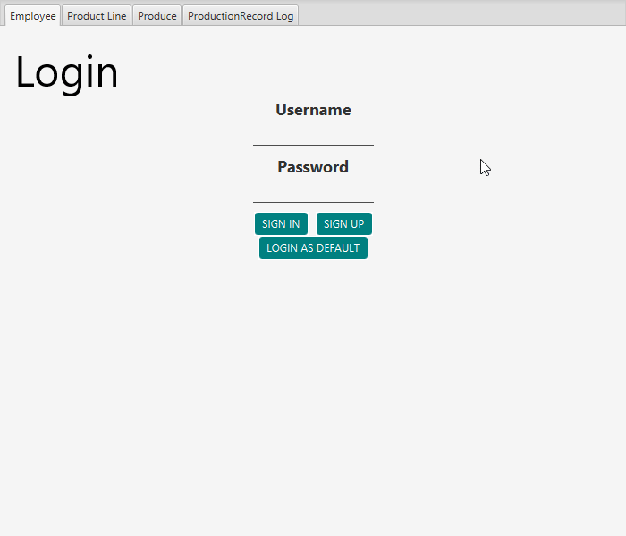
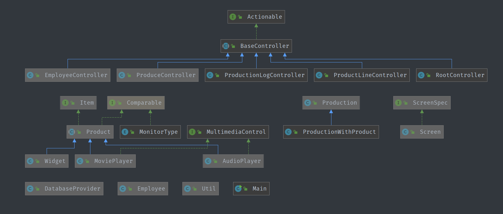
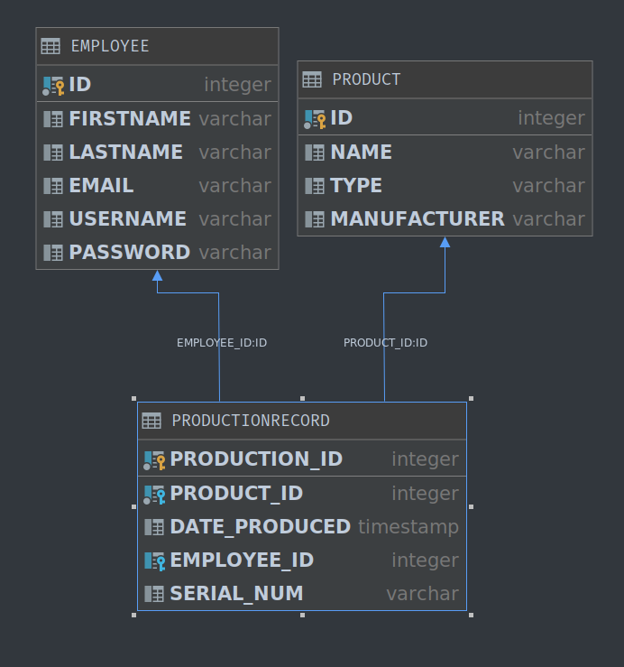

# Product Line OOP Project

## Demonstration

## Documentation
The purpose of this application is to display and tie together concepts learned in Object-Oriented Programming (COP3003) by creating a Java project using a JavaFX GUI and SQL using the H2 database engine that creates, stores, and retrieves products given the user's input.

## Diagrams
**Class Diagram**

**Database Diagram**

## Getting Started
IntelliJ:
* File -> New -> Project from Version Control -> Git
    * URL: https://github.com/tgayle/ProductLineOOProject
* Open Project
* Navigate to File -> Project Structure -> Set Project SDK to 1.8 if necessary
* If "Maven projects need to be imported" appears in corner, *Enable Auto-Import*
* Go to Main.java in src/main/java/frontend and press the play button next to `public class Main...`

## Built With
* Java 8
* JavaFX 8
* H2 SQL Database
* JFoenix Material Design Library
* IntelliJ

## Author
* Travis Gayle

## License
Copyright 2019, Travis Gayle

Permission is hereby granted, free of charge, to any person obtaining a copy of this software and associated documentation files (the "Software"), to deal in the Software without restriction, including without limitation the rights to use, copy, modify, merge, publish, distribute, sublicense, and/or sell copies of the Software, and to permit persons to whom the Software is furnished to do so, subject to the following conditions:

The above copyright notice and this permission notice shall be included in all copies or substantial portions of the Software.

THE SOFTWARE IS PROVIDED "AS IS", WITHOUT WARRANTY OF ANY KIND, EXPRESS OR IMPLIED, INCLUDING BUT NOT LIMITED TO THE WARRANTIES OF MERCHANTABILITY, FITNESS FOR A PARTICULAR PURPOSE AND NONINFRINGEMENT. IN NO EVENT SHALL THE AUTHORS OR COPYRIGHT HOLDERS BE LIABLE FOR ANY CLAIM, DAMAGES OR OTHER LIABILITY, WHETHER IN AN ACTION OF CONTRACT, TORT OR OTHERWISE, ARISING FROM, OUT OF OR IN CONNECTION WITH THE SOFTWARE OR THE USE OR OTHER DEALINGS IN THE SOFTWARE.

## Acknowledgments
* [StackOverflow](https://stackoverflow.com)
* **Scott Vanselow** - Object Oriented Programming Instructor
* **Damian Morgan** - Object Oriented Programming Teaching Assistant

## History
* 9/28/19 - Program Alpha Completed
* 11/9/19 - Program Beta Completed
* 11/25/19 - Final Project Completed

## Key Programming Concepts Utilized
* Object Oriented Programming
* Polymorphism
* Dynamic Dispatch
* Inheritance
* Functional Interfaces
* Encapsulation